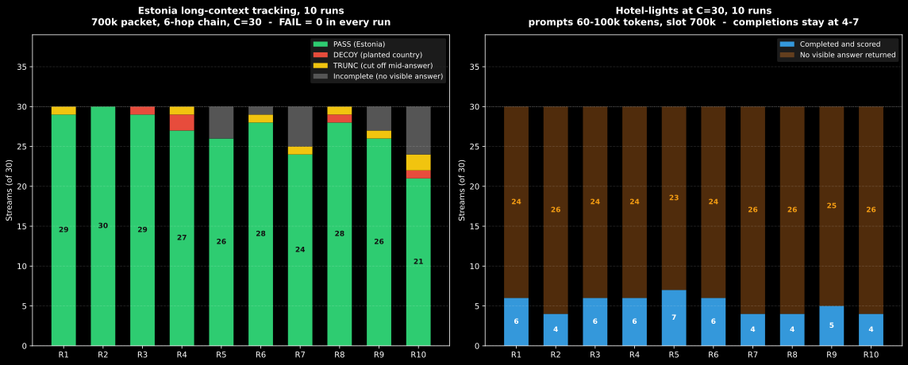

# GLM-5.3-Flash EXL3 (3.5bpw) inference benchmarks

Long-context quality and concurrency measurements for the mixed-precision
GLM-5.3-Flash EXL3 deployment, taken with
[llm-inference-bench](https://github.com/local-inference-lab/llm-inference-bench)
against the live serve.

The headline result: across 13 Estonia runs (390 streams) the model never
asserted a wrong country. Every non-PASS is a planted decoy, a truncated
answer, or a stream that returned no visible answer. FAIL = 0 in every run.

---

## 1. What was measured

Two built-in profiles, both at fixed concurrency C=30:

- **estonia** - a 700k-character packet resampled per stream. The model must
  follow a six-hop cross-reference chain past planted decoys and name the
  vendor's country. Scoring: PASS (asserted the expected country), DECOY
  (committed to the planted wrong country), NOT_STATED (gave up), FAIL
  (any other wrong answer). TRUNC/STALL/TIMEOUT never produced a visible
  answer and are reported separately. Private reasoning is never scored.
- **hotel-lights** - uncapped arithmetic over long state. Scoring: EXACT /
  FAIL on the asserted final number, same incomplete-stream split.

Two arms:

| arm | runner | sampling | runs |
|---|---|---|---|
| bench2 | `run_bench2_10x_estonia_hotel-lights.sh` | server defaults (temperature 1.0, top_p 0.95, from `generation_config.json`) | 10 estonia + 10 hotel |
| bench1 | `run_bench1_3x_estonia.sh` | `--temperature 0.0` explicit | 3 estonia |

Raw logs are in `bench2_results/` and `bench1_results/`. The chart is
generated from those logs by `generate_charts.py` and shows every run.

### Serve configuration

```text
Host:        Dual RTX Pro 6000
Quant:       EXL3 mixed, 3.5 bpw (exl3-mixed.py)
KV cache:    fp8_ds_mla (DeepSeek MLA)
Attention:   FLASHINFER_MLA_SPARSE_SM120
Topology:    TP=2, decode-context-parallel 1
Context:     --max-model-len 700000
Batching:    --max-num-batched-tokens 1024, --max-num-seqs 4
Speculation: MTP, 3 tokens, draft_sample_method=probabilistic
Sampling:    temperature 1.0, top_p 0.95 (generation_config.json defaults;
             this vLLM build has no --temperature/--top-p CLI flags)
```

Paths in the launch command below are placeholders; the real layout is local
to the host.

```bash
docker run \
--name glm53-k35-fp8-vision \
--init \
--gpus "device=0,1" \
--ipc=host \
--shm-size 32g \
-p 8012:8012 \
-e VLLM_ENGINE_READY_TIMEOUT_S=3600 \
-e VLLM_API_KEY \
-e VLLM_B12X_GLM_NOPE_NVFP4=1 \
-e VLLM_USE_B12X_DCP_A2A=1 \
-e VLLM_B12X_MLA_CKV_GATHER=0 \
-e VLLM_EXL3_PREFILL_BLOCK_M=64 \
-e OMP_NUM_THREADS=2 \
-e NCCL_IB_DISABLE=1 \
-e VLLM_EXL3_R7_FUSED=1 \
-e NCCL_P2P_DISABLE=1 \
-e NCCL_P2P_LEVEL=4 \
-e NCCL_PROTO=LL,LL128,Simple \
-v /path/to/artifact-glm53-k35-mixed:/model:ro \
-v /path/to/patches/rotary_common.py:/opt/infernal-invocation/vllm/vllm/model_executor/layers/rotary_embedding/common.py:ro \
-v /path/to/patches/responses_utils.py:/opt/infernal-invocation/vllm/vllm/entrypoints/openai/responses/utils.py:ro \
-v /path/to/exl3-mixed.py:/opt/infernal-invocation/vllm/vllm/model_executor/layers/quantization/exl3.py:ro \
-v /path/to/exl3-cache:/root/.cache \
--entrypoint vllm glm53-exl3:dflash2-mixed serve /model \
--served-model-name GLM-5.3-Flash-EXL3-3.5bpw-fp8 \
--enable-auto-tool-choice \
--tool-call-parser glm45 \
--host 0.0.0.0 \
--port 8012 \
--limit-mm-per-prompt '{"image":4,"video":0}' \
--tensor-parallel-size 2 \
--decode-context-parallel-size 1 \
--dcp-comm-backend a2a \
--dtype bfloat16 \
--load-format safetensors \
--moe-backend b12x \
--attention-backend FLASHINFER_MLA_SPARSE_SM120 \
--kv-cache-dtype fp8_ds_mla \
--max-model-len 700000 \
--max-num-batched-tokens 1024 \
--max-num-seqs 4 \
--gpu-memory-utilization 0.977 \
--enable-chunked-prefill \
--generation-config /model \
--reasoning-parser glm45 \
--disable-custom-all-reduce \
--speculative-config '{"method":"mtp","num_speculative_tokens":3,"draft_sample_method":"probabilistic"}' \
--enable-prefix-caching
```

Sampling is **temperature 1.0, top_p 0.95**, applied like this:

1. The values live in `generation_config.json` inside the model artifact
   (`temperature: 1.0`, `top_p: 0.95`).
2. `--generation-config /model` in the command above tells the server to read
   that file and use it as the default sampling parameters for every request.
3. Any request that sends its own `temperature` or `top_p` overrides the file
   for that request only. That is how the bench1 arm ran at temperature 0
   while the server default stayed 1.0.

They are not command-line flags because this vLLM build
(`glm53-exl3:dflash2-mixed`) has no `--temperature` or `--top-p` arguments;
passing them makes the container exit at startup. The boot log confirms the
file path is what actually took effect: `Default vLLM sampling parameters have
been overridden by /model: {'temperature': 1.0, 'top_p': 0.95}`.


---

## 2. Results

### Estonia, stochastic arm (bench2, 10 runs)

| run | completed | score |
|---|---|---|
| 1 | 30/30 | PASS 29 / TRUNC 1 |
| 2 | 30/30 | PASS 30 |
| 3 | 30/30 | PASS 29 / DECOY 1 |
| 4 | 30/30 | PASS 27 / DECOY 2 / TRUNC 1 |
| 5 | 26/30 | PASS 26 |
| 6 | 29/30 | PASS 28 / TRUNC 1 |
| 7 | 25/30 | PASS 24 / TRUNC 1 |
| 8 | 30/30 | PASS 28 / DECOY 1 / TRUNC 1 |
| 9 | 27/30 | PASS 26 / TRUNC 1 |
| 10 | 24/30 | PASS 21 / DECOY 1 / TRUNC 2 |

Totals: 300 streams, 268 PASS, 5 DECOY, 9 TRUNC, 18 incomplete, **0 FAIL**.
Of the streams that produced an answer, 268/273 (98.2%) named the right
country; the other 5 named the planted decoy, never an invented one.

### Estonia, temperature 0 arm (bench1, 3 runs)

| run | completed | score |
|---|---|---|
| 1 | 26/30 | PASS 24 / TRUNC 2 |
| 2 | 27/30 | PASS 25 / TRUNC 2 |
| 3 | 30/30 | PASS 30 |

PASS 24-30, same band as the stochastic arm. Forcing temperature 0 does not
tighten the spread. (Note this arm is 3 runs; it rules out a large effect,
not a small one.)

### Hotel-lights, stochastic arm (bench2, 10 runs)

| run | completed | score |
|---|---|---|
| 1 | 6/30 | EXACT 5 / FAIL 1 |
| 2 | 4/30 | EXACT 4 |
| 3 | 6/30 | EXACT 3 / FAIL 1 / TRUNC 1 / STALL 1 |
| 4 | 6/30 | EXACT 5 / FAIL 1 |
| 5 | 7/30 | EXACT 7 |
| 6 | 6/30 | EXACT 5 / TRUNC 1 |
| 7 | 4/30 | EXACT 3 / TRUNC 1 |
| 8 | 4/30 | EXACT 1 / TRUNC 1 / STALL 2 |
| 9 | 5/30 | EXACT 3 / FAIL 1 / TRUNC 1 |
| 10 | 4/30 | EXACT 3 / TRUNC 1 |

Completions stay between 4 and 7 of 30 in every run. Of the 52 streams that
produced an answer, 39 were exact (75%) and 4 were wrong by exactly one
(expected 48, got 49 in run 1; expected 48, got 47 in run 3). The rest were
cut off before a final number.



---

## 3. What the data supports

**The weights track the chain.** FAIL = 0 across all 13 Estonia runs means
the model does not invent countries under this load. The failure mode, when
it fails, is falling for a decoy that was deliberately planted in the
packet - 5 times in 300 streams. That is a small, specific, bounded error,
and it happens at temperature 0 as well as at temperature 1, so it is not a
sampling artifact.

**Sampling temperature is not the variance driver.** The stochastic arm
scored PASS 21-30 and the temperature-0 arm scored PASS 24-30, including a
perfect 30/30 in each arm. A perfect run therefore says nothing about
determinism or weight quality; it is one draw from the same distribution.
Whatever moves the score between runs survives greedy decoding. The MTP
speculative head (`draft_sample_method=probabilistic`) is a candidate,
because it injects variance even when the verifier samples greedily, but
this data does not isolate it - no arm here disables MTP.

**Hotel-lights at C=30 is a capacity problem, not a measured stall.** The
bench logs prompts of 60k-100k tokens. Thirty of those is 1.8M-3M tokens of
concurrent context against a 700k slot, so most requests cannot be resident
at once. The logs show 4-7 completions per run and do not show queue
deadlocks, engine errors, or scheduler failures. Calling the other ~24
streams "dropped" overclaims what was recorded: they returned no visible
answer within the bench window. Whether widening `--max-num-batched-tokens`
(1024 here) would raise the completion count is a hypothesis, not a result -
it was not varied in this run.

## 4. What was tested and found not to help

- **Temperature 0** (bench1, 3 runs): no improvement over the stochastic arm.
  Forcing greedy decoding is not the fix for the Estonia spread.
- The earlier draft of this document claimed one hotel stream emitted
  131,977 tokens of collapsed output. That number does not appear in any log
  in this directory and has been removed.

## 5. Open questions

These are the measurements that would actually move the conclusions:

1. An Estonia arm with MTP disabled, same C=30, to see whether the
   probabilistic draft head is the variance source.
2. A hotel-lights concurrency sweep (C=2, 4, 8) to find where completions
   stop scaling, separating slot capacity from scheduler behavior.
3. One hotel run at a wider `--max-num-batched-tokens` to test the batching
   hypothesis directly.
